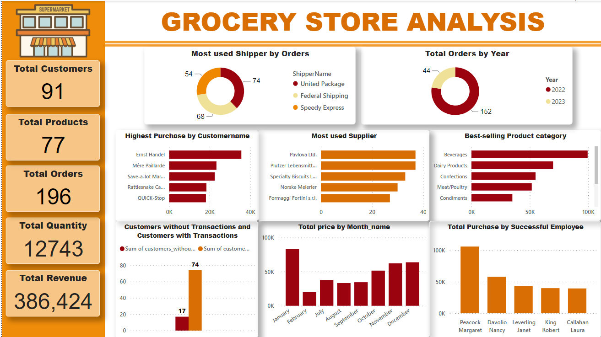

# Grocery Store Analysis
---

---

### Project Overview:
This project is a strategic initiative aiming at uncovering important insights that will alter how retail businesses are understood and managed. 
Additionally, to improve operations and customer satisfaction.

### Data Source:
The dataset utilized for this analysis on grocery stores is a CSV file sourced from Kaggle. 
It consists of interconnected tables each containing detailed information necessary, for conducting a thorough analysis of grocery stores.

### Tools: 
I used MySQL for in-depth analysis and Power BI, which is a user-friendly tool, for visualizing data.

### Data Cleaning and Preparation:
1. The dataset was thoroughly cleaned to guarantee the precision and dependability of the data structure. I was able to identify key tables and their relationships. 
Created columns for each table in the database that will enhance the analysis.

* Example:
```SQL
-- create tables
CREATE TABLE `orders` (
    `OrderID` int  NOT NULL ,
    `CustomerID` int  NOT NULL ,
    `EmployeeID` int  NOT NULL ,
    `OrderDate` date  NOT NULL ,
    `ShipperID` int  NOT NULL ,
    PRIMARY KEY (
        `OrderID`
    )
);

ALTER TABLE `orders` ADD CONSTRAINT `fk_orders_CustomerID` FOREIGN KEY(`CustomerID`)
REFERENCES `customers` (`CustomerID`);
```
2. Handled and replaced missing or null values.

* Example:
```SQL
-- Replace 'ö' with 'ö'

select CustomerName,
		case
        when CustomerName like "%ö%" then replace(CustomerName, 'ö', 'ö')
        else CustomerName
        end as "Clean Name"
from customers;

update customers
set CustomerName = (select
		case
        when CustomerName like "%ö%" then replace(CustomerName, 'ö', 'ö')
        when Customername like "%í%" then replace(CustomerName, 'í', 'i')
        else CustomerName
        end);
set sql_safe_updates = 0;
```

### Exploratory Data Analysis (EDA):
Attached copy of the EDA is above. 

### Recommendations:
* Based on the analysis, we should proritize ongoing training programs to enhance staff knowledge and customer service skills for a positive shopping experience. 
* Flexible pricing strategies should be implemented to maximize revenue during peak periods.
* Act on customer feedback to enhance service.
* Collaborate with more suppliers to expand product offerings and improve overall convenience for customers.

#### _You can interact with the dashboard_ [here](https://app.powerbi.com/groups/me/reports/ade3133a-233c-41af-9a39-90adfeed3808?ctid=7a7d9927-84e9-4910-b10f-850c64b28029&pbi_source=linkShare)


